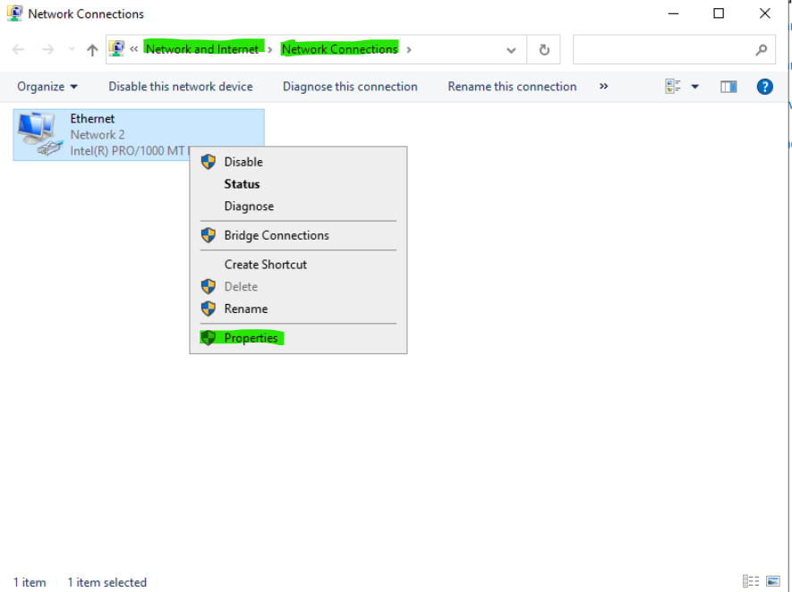
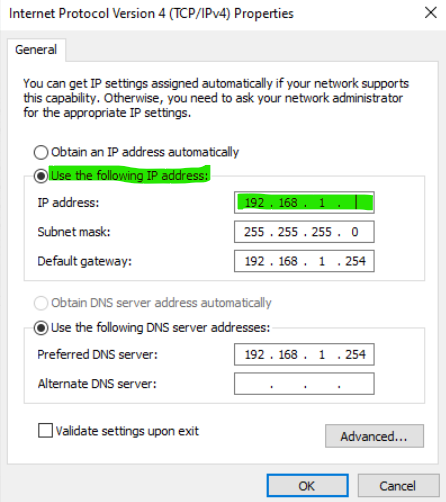

# Documentation du Projet de Gestion de Tâches à Distance via Script

## Prérequis Techniques

### Matériel
- Machines distantes connectées sur le même réseau.
- Machine locale pour l'exécution des scripts.

### Logiciel
- **Systèmes d'exploitation** :
  - OS : Windows Server
  - Version : 2022
  - OS : Windows 
  - Version : 10
- **Langages de script** :
  - Powershell
  - Bash
- **Outils et dépendances** :
  - OpenSSH (pour les connexions SSH)
  - Git (pour le contrôle de version)
  - 
- **Permissions** :
  - Accès administrateur sur les machines distantes pour exécuter certaines tâches.

## Étapes d'Installation et de Configuration

### 1. Préparation de l'Environnement

#### a. Configurations des clients

- Client Windows 10 
- Nom : CLIWIN01
- Compte utilisateur : wilder (dans le groupe des admins locaux)
- Mot de passe : Azerty1*
- Adresse IP fixe : 192.168.1.40

 #### b. Configurations des serveurs
 
- Serveur Windows Server 2022 :
- Nom : SRVWIN01
- Compte : Administrator (dans le groupe des admins locaux)
- Mot de passe : Azerty1*
- Adresse IP fixe : 192.168.1.43
  
 #### c. Configurations des adresses IP fixe pour la mise en réseau

 - Configuration de l'IP statique sur Windows Server et Windows 10 en interface graphique

1. **Ouvrir le Centre Réseau et Partage :**
   - Cliquez sur l'icône réseau dans la barre des tâches.
   - Sélectionnez "Centre Réseau et partage".

2. **Modifier les paramètres de l'adaptateur :**
   - Dans le panneau de gauche, cliquez sur "Modifier les paramètres de la carte".

3. **Sélectionner l'adaptateur réseau :**
   - Faites un clic droit sur l'adaptateur réseau que vous souhaitez configurer.
   - Sélectionnez "Propriétés".
     


4. **Configurer TCP/IPv4 :**
   - Dans la liste, sélectionnez "Protocole Internet version 4 (TCP/IPv4)".
   - Cliquez sur "Propriétés".
  


5. **Entrer les informations IP :**
   - Sélectionnez "Utiliser l'adresse IP suivante".
   - Entrez l'adresse IP : `192.168.1.40`. pour le Windows client et `192.168.1.43` pour le Windows Server
   - Masque de sous-réseau : `255.255.255.0` 
   - Passerelle par défaut : entrez l'adresse IP de votre routeur (par exemple, `192.168.1.254`).

6. **Configurer les serveurs DNS :**
   - Serveurs DNS préféré  `192.168.1.254` 



7. **Valider les paramètres :**
   - Cliquez sur "OK" pour fermer les fenêtres de propriétés.
   - Cliquez sur "Fermer" pour terminer la configuration.

 #### d. Configurations des pare-feu pour la connectivité
## Pour Windows

1. **Ouvrir le Pare-feu Windows avec fonctions avancées de sécurité :**
   - Cliquez sur le bouton Démarrer et tapez "Pare-feu Windows avec fonctions avancées de sécurité".
   - Cliquez sur l'application correspondante pour l'ouvrir.

2. **Créer une règle entrante pour ICMP :**
   - Dans le panneau de gauche, cliquez sur "Règles de trafic entrant".
   - Dans le panneau de droite, cliquez sur "Nouvelle règle...".
   - Sélectionnez "Personnalisée" et cliquez sur "Suivant".
   - Sélectionnez "Tous les programmes" et cliquez sur "Suivant".
   - Sélectionnez "Type de protocole" et choisissez "ICMPv4" dans le menu déroulant.
   - Cliquez sur "Suivant".
   - Sélectionnez "Adresse IP source" pour définir les adresses spécifiques ou laissez "Toutes les adresses" pour permettre les pings de n'importe quelle source.
   - Cliquez sur "Suivant".
   - Sélectionnez "Autoriser la connexion".
   - Cliquez sur "Suivant".
   - Choisissez les profils pour lesquels cette règle s'applique (Domaine, Privé, Public).
   - Cliquez sur "Suivant".
   - Donnez un nom à la règle (par exemple, "Autoriser ICMPv4 Entrant") et cliquez sur "Terminer".
  
  #### e. Installation et configuration de la connexion SSH Serveur/client LINUX
 

1. Installation de SSH  
 
L'installation de SSH (Secure Shell) permet d'établir une connexion sécurisée entre un serveur et un client. Cette connexion chiffrée garantit la confidentialité et l'intégrité des données échangées.

#### Sur le serveur :

```bash
sudo apt-get install openssh-server
```
#### Sur le client :

```bash
sudo apt-get install openssh-client
```
2. Génération de clés SSH sur le serveur    

Générez une paire de clés SSH sur le serveur pour une authentification sécurisée.
La génération d'une paire de clés SSH (clé privée et clé publique) renforce la sécurité de la connexion SSH en utilisant une méthode d'authentification par clé publique plutôt qu'un simple mot de passe.

```bash
ssh-keygen -t rsa -b 4096 -C "commentaire"
```

3. Mise en place d'un agent SSH sur le serveur  

L'agent SSH permet de gérer les clés privées et d'éviter de saisir la phrase secrète de la clé privée à chaque utilisation. Il stocke les clés en mémoire et les utilise pour authentifier les connexions SSH.  


```bash
eval $(ssh-agent -s)
```
4. Ajout de la clé privée à l'agent sur le serveur  

```bash
ssh-add ~/.ssh/id_rsa
```
5. Vérification de l'ajout de la clé sur le serveur  

```bash
ssh-add -l
```
6. Copie de la clé publique sur le PC client  

```bash
ssh-copy-id utilisateur@adresse_ip_du_client
```
7. Connexion en SSH depuis le serveur vers le client  

Cette commande initie une connexion SSH sécurisée depuis le serveur vers le client, utilisant la clé publique pour l'authentification. Si les étapes précédentes ont été correctement effectuées, aucune saisie de mot de passe ne sera nécessaire.

```bash
ssh utilisateur@adresse_ip_du_client
```
8. Vérification des Pare-feux  

Ces commandes configurent le pare-feu UFW pour autoriser les connexions entrantes(serveur) et sortantes(client) sur le port SSH (par défaut, le port 22) et activent le pare-feu pour appliquer les règles.      

Sur le serveur Debian :

```bash
sudo ufw allow ssh
sudo ufw enable
```
Sur le poste client Linux :

```bash
sudo ufw allow out ssh
sudo ufw enable
```
9. Automatisation de l'Agent SSH    

Pour éviter d'initialiser l'agent SSH et d'ajouter la clé à chaque nouvelle session, on a automatisé ces étapes.

Edition du fichier de configuration du shell :

```bash
nano ~/.bashrc
```
Ajout des lignes suivantes à la fin du fichier :

```bash
# Initialiser l'agent SSH
eval $(ssh-agent -s)

# Ajouter la clé privée à l'agent SSH
ssh-add ~/.ssh/id_rsa
```
Recharge du fichier de configuration du shell :  
```
source ~/.bashrc
```

#### d. Installation et configuration de la connexion à distance Serveur/client WINDOWS

## **Activer PowerShell Remoting**
_Sur le poste client_
Ouvrir une session PowerShell en tant qu'administrateur et exécuter la commande suivante :
```Enable-PSRemoting -Force```


_Sur le serveur_
Ouvrir une session PowerShell en tant qu'administrateur et exécuter la commande suivante :
```Enable-PSRemoting -Force```

Cela permettra d'activer le PSRemoting sur les deux machines. Une fois PSRemoting activé, il le reste tant que l'on ne l'interrompt pas manuellement.


## **Configurer la confiance entre les machines**
Il faut ajouter les différentes machines aux hôtes de confiance. Il faudra sur le client et sur le serveur rentrer la commande suivante :

```Set-Item wsman:\localhost\Client\TrustedHosts -Value "NomMachine"```

Il faudra remplacer "NomMachine" par l'adresse IP du serveur sur le client et l'adresse IP du client sur le serveur.

Pour tester la connexion entre les machines, on peut utiliser la commande :
```Test-WsMan -ComputerName NomMachine```

S'il est concluant, on obtient :


La connnexion entre les machines est effective, mais on ne peut toutefois pas encore exécuter de commandes à distance, il faut pour cela créer un compte-administrateur sur le client et configurer son Pare-Feu.

## **Configuration du Pare-Feu**
Sur le poste client, il faudra créer une règle de Pare-feu qui autorise les connexions WinRM. Le port par défaut pour WinRM sur HTTP est **5985**, en HTTPS ce sera le port **5986**
Il faudra employer les commandes suivantes :
Sur HTTP :
```New-NetFirewallRule -Name "AllowWinRM" -DisplayName "Allow WinRM" -Protocol TCP -LocalPort 5985 -Action Allow``` 

Sur HTTPS :
```New-NetFirewallRule - Name "AllowWin-HTTPS" -DisplayName "Allow WinRM (HTTPS)" -Protocol TCP -LocalPort 5986 -Action Allow ```

## **Installation du compte administrateur local**
Sur la machine client, ouvrir PowerShell en tant qu'admin et créer l'utilisateur avec la commande suivante, en remplaçant "NomAdmin" par le nom que l'on souhaite donner au compte administrateur et "Mdp" par le mot de passe que l'on souhaite y attribuer.

```net user NomAdmin Mdp /add```

Il faudra ensuite ajouter le nouveau compte au groupe Administrateurs :

```net localgroup Administrateurs "NomAdmin" /add```

Désormais, on peut effectuer des commandes à distance depuis le serveur, il faudra renseigner le nom d'utilisateur et le mot de passe à chaque fois.

## **Automatisation des logs**
Pour ne pas avoir à rentrer les identifiants à chaque nouvelle commande effectuée sur le poste distant, on peut stocker les informations d'identification dans un fichier sécurisé. Notez que ces informations devront être les mêmes pour les comptes administrateurs de tous les postes clients.

```
$NomUtilisateur = admin
$MotDePasse = Read-Host -AsSecureString Azerty1*
$Cred = New-Object System.Management.Automation.PSCredential($NomUtilisateur, $MotDePasse)
$Cred | Export-Clixml -Path "C:\chemin\vers\cred.xml"
```

Pour Exécuter les commandes à distances, il faudra inclure dans les scripts 

```
$Cred = Import-Clixml -Path "C:\Users\Administrator\pclients\cred.xml"
Invoke-Command -ComputerName IPduposteclient -Credential $Cred -ScriptBlock {scriptàlancer}
```


## **Action du serveur Windows vers le client Linux**
```Invoke-Command```ne fonctionnant pas nativement pour les distributions Linux, il a fallu trouver une autre solution. Nous avons opté pour l'établissement d'une connexion SSH car il s'agit d'un media sécurisé. Pour établir cette connexion, il est nécessaire d'employer une application tierce : Putty ou OpenSSH. Notre choix s'est porté sur OpenSSH, car il s'agit d'une application native de Windows.

### **Sur la machine Debian**
Il faut tout d'abord installer OpenSSH Server via la commande 
```
sudo apt update
sudo apt install openssh-server
```
On peut vérifier s'il est en cours d'exécution via ```sudo systemctl status ssh``` 
S'il n'est pas actif, on peut le démarrer avec ```sudo systemctl start ssh```

Il faudra par la suite autoriser SSH dans le pare-feu avec les commandes 
```
sudo ufw allow ssh
sudo ufw enable
```

On peut modifier le fichier /etc/ssh/sshd_config pour modifier les paramètres de connexion, pour autoriser la connexion par mot de passe, par clé.

### **Sur le serveur Windows**
Il est nécessaire d'installer un client SSH pour permettre à la machine de se connecter à la machine Linux pour y exécuter des commandes à distance. Il est nativement installé sur la distribution Windows Server. S'il ne l'est pas, on peut l'installer via le "Gestionnaire de serveur", "ajouter des fonctionnalités".

Dans les fonctionnalités, sélectionner "Client OpenSSH" puis installer.

### **Etablir la connexion SSH**
Pour initialiser la connexion entre le Windows Server et le client Linux, il faut employer la commande :

```
ssh nom-utilisateur@adresse-ip
```

Le mot de passe de la session utilisateur sera demandée. Une fois celui-ci rentré, la connexion est initialisé.

### **Utilisation d'une paire de clés de sécurité**
Afin d'assurer la sécurité de la connexion, on va employer une paire de clés SSH, elles permettront d'établir la connexion sans fournir de mot de passe. C'est la présence de la clé sur l'appareil qui permettra d'établir la connexion. Il faut tout d'abord générer les clés.
```
ssh-keygen
```
Deux clés vont être générées : une clé privée et une clé publique. La clé publique fera office de serrure, aussi il faut la copier sur le client. Un fichier contenant les clés y existe déjà au chemin ~/.ssh/authorized-keys . On va ajouter une nouvelle ligne à ce fichier 
```
scp C:\Users\Administrator\.ssh\id_rsa.pub utilisateurclient@ipclient:/tmp/id_rsa.pub
```
Le fichier sera copié sur le client Linux, il n'y aura plus qu'à le copier dans le fichier depuis le client.
```
cat ~/utilisateur/tmp/id_rsa.pub >> ~/.ssh/authorized_keys
